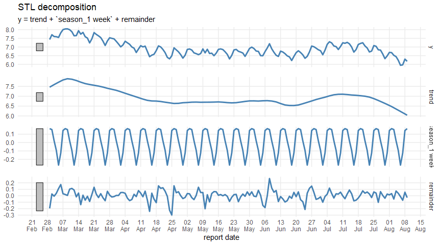
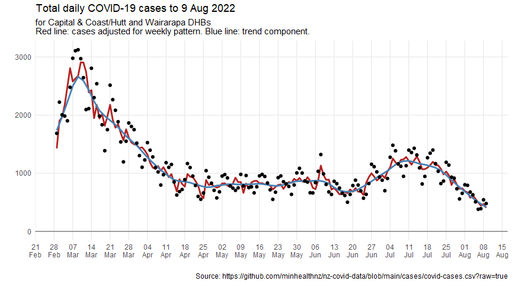
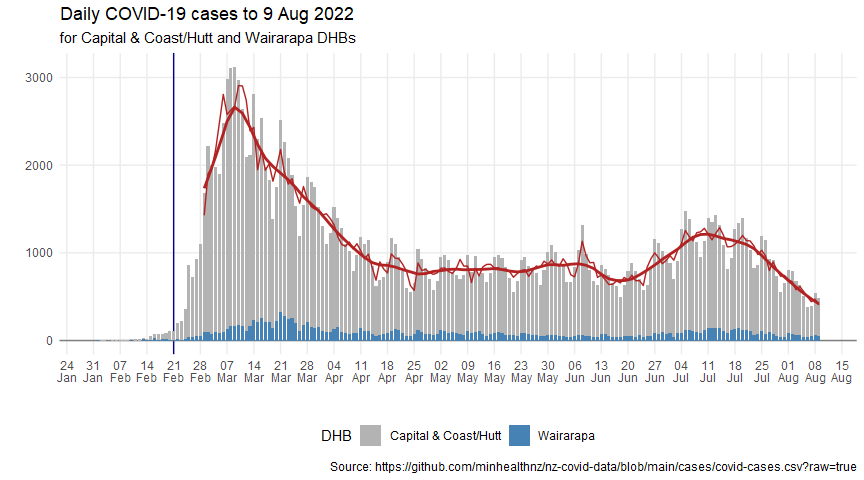

COVID-19 post-peak time series analysis
================

# Exploring COVID-19 time series for Wellington DHBs

Focusing on trends and seasonality after the early 2022 Omicron peak.

## Initialise

``` r
case_data_url <- "https://github.com/minhealthnz/nz-covid-data/blob/main/cases/covid-cases.csv?raw=true"
# dhb_names <- c("Capital and Coast", "Hutt Valley", "Wairarapa")
dhb_names <- c("Capital & Coast/Hutt", "Wairarapa") # DHB name changes
dhb_names_label <- glue_collapse(dhb_names, sep = ", ", last = " and ")

nice_date_format <- function(input_date) {
  str_trim(format(input_date, '%e %b %Y'))
}

analysis_start_date <- ymd(20220201)
wfh_start_date <- ymd(20220221)
model_start_date <- ymd(20220301)
```

## Download and summarise latest data

``` r
cases_df <- read_csv(case_data_url) %>% 
  clean_names()
```

    ## Rows: 1540509 Columns: 7

    ## -- Column specification --------------------------------------------------------
    ## Delimiter: ","
    ## chr  (5): Case Status, Sex, Age group, DHB, Overseas travel
    ## lgl  (1): Historical
    ## date (1): Report Date

    ## 
    ## i Use `spec()` to retrieve the full column specification for this data.
    ## i Specify the column types or set `show_col_types = FALSE` to quiet this message.

``` r
latest_report_date <- cases_df %>% pull(report_date) %>% max()

cases_by_dhb_df <- cases_df %>% 
  count(report_date, dhb, case_status)
```

## Wellington figures up to 20 Jul 2022

Including Hutt and Wairarapa as well as CCDHB.

``` r
dhb_cases_df <- cases_by_dhb_df %>% 
  filter(dhb %in% dhb_names) %>% 
  filter(report_date >= analysis_start_date) %>% 
  group_by(report_date, dhb) %>% 
  summarise(cases = sum(n, na.rm = FALSE))
```

    ## `summarise()` has grouped output by 'report_date'. You can override using the `.groups` argument.

## Timeseries analysis

To best capture the weekly seasonality, it might be best to start modelling from about the time that the reporting process was changed by RATs: probably about the beginning of March.

We first do a log + 1 transform to allow for multiplicative seasonality. This is especially important now that cases are falling.

``` r
y_transform <- log1p
inverse_transform <- expm1

dhb_cases_ts <- dhb_cases_df %>% 
  group_by(report_date) %>% 
  summarise(cases = sum(cases, na.rm = FALSE)) %>% 
  ungroup() %>% 
  filter(report_date >= model_start_date) %>% 
  select(report_date, cases) %>% 
  as_tsibble(index = report_date) %>% 
  fill_gaps(cases = 0) %>% 
  replace_na(list(cases = 0))

dhb_cases_transformed_ts <- dhb_cases_ts %>% 
  mutate(y = y_transform(cases))

dhb_cases_transformed_stl <- dhb_cases_transformed_ts %>% 
  model(STL(y ~ trend(window = 7 * 2) + season(period = "1 week", window = Inf))) %>% 
  components()

dhb_cases_transformed_stl %>% 
  autoplot(colour = "steelblue", size = 1) +
  scale_x_date(date_breaks = "1 week", date_labels = "%d\n%b") +
  labs(x = "report date") +
  theme_minimal() +
  theme(panel.grid.minor = element_blank(), panel.spacing.y = unit(1, "lines"))
```



``` r
dhb_cases_after_transform_stl_df <- dhb_cases_transformed_stl %>% 
  select(report_date, y, trend, season_adjust) %>% 
  as_tibble() %>% 
  mutate(across(where(is.numeric), inverse_transform)) %>% 
  rename(cases = y)

dhb_cases_after_transform_stl_df %>% 
  ggplot() +
  geom_hline(yintercept = 0, colour = "grey50") +
  geom_line(aes(x = report_date, y = season_adjust), colour = "firebrick", size = 1) +
  geom_line(aes(x = report_date, y = trend), colour = "steelblue", size = 1) +
  geom_point(aes(x = report_date, y = cases)) +
  scale_x_date(date_breaks = "1 week", date_labels = "%d\n%b") +
  scale_y_continuous(limits = c(0, NA)) +
  labs(x = "", y = "", title = str_glue("Total daily COVID-19 cases to {nice_date_format(latest_report_date)}"),
       subtitle = str_glue("for {dhb_names_label} DHBs\n", 
                           "Red line: cases adjusted for weekly pattern. Blue line: trend component."),
       caption = str_glue("Source: {case_data_url}")) +
  theme_minimal() +
  theme(panel.grid.minor = element_blank())
```



## Summary visualisation

``` r
dhb_pal <- scales::seq_gradient_pal(low = "steelblue", high = "grey70")(seq(0, 1,length.out = length(dhb_names))) %>% 
  rev()

dhb_cases_df %>%
  ggplot() +
  geom_vline(xintercept = wfh_start_date, colour = "darkblue") +
  geom_hline(yintercept = 0, colour = "grey50") +
  geom_col(aes(x = report_date, y = cases, fill = dhb), position = "stack", width = 0.8) +
  geom_line(data = dhb_cases_after_transform_stl_df,
            aes(x = report_date, y = season_adjust), colour = "firebrick", size = 0.5) +
  geom_line(data = dhb_cases_after_transform_stl_df,
            aes(x = report_date, y = trend), colour = "firebrick", size = 1) +
  scale_y_continuous(limits = c(0, NA)) +
  scale_x_date(date_breaks = "1 week", date_labels = "%d\n%b") +
  scale_fill_manual(values = dhb_pal, guide = guide_legend(title = "DHB")) +
  labs(x = "", y = "", title = str_glue("Daily COVID-19 cases to {nice_date_format(latest_report_date)}"),
       subtitle = str_glue("for {dhb_names_label} DHBs"),
       caption = str_glue("Source: {case_data_url}")) +
  theme_minimal() +
  theme(panel.grid.minor = element_blank(), legend.position = "bottom")
```



## Comparison to peak cases

``` r
peak_cases <- dhb_cases_after_transform_stl_df %>% 
  slice_max(order_by = cases, n = 1)

minima <- dhb_cases_after_transform_stl_df %>% 
  filter(report_date >= peak_cases$report_date) %>% 
  summarise(cases = min(cases), adjusted = min(season_adjust), trend = min(trend))

maxima <- dhb_cases_after_transform_stl_df %>% 
  summarise(cases = max(cases), adjusted = max(season_adjust), trend = max(trend))
```

Looking at raw case numbers, the peak on 9 Mar 2022 was about 6.2 times the lowest recent value.

But when adjusting for the weekly pattern, it was 5.1 times the lowest recent adjusted value, and the trend was about 3.9 times the lowest recent trend line.

While the trend might be over-smoothed, the peak coincinded with the strong weekly pattern, suggesting that the apparent difference between the peak and now was exaggerated by weekly differences in reporting.

## Notes

The true case numbers are likely higher than reported, but the shape of the curve is more important for this analysis than the absolute numbers. There was also likely to have been a change in reporting rates when use of RATs became widespread, so comparing case numbers before and after that would be problematic, but this was well before the peak for these DHBs.
