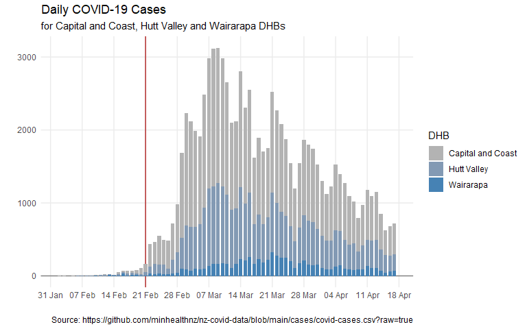
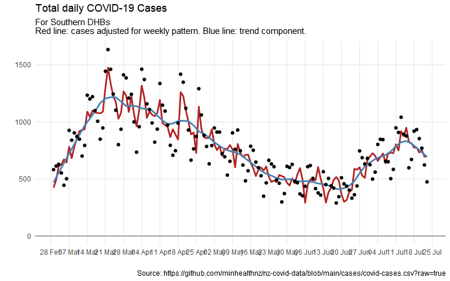

COVID-19 time series analysis
================

## Initialise

``` r
case_data_url <- "https://github.com/minhealthnz/nz-covid-data/blob/main/cases/covid-cases.csv?raw=true"
dhb_names <- c("Capital and Coast", "Hutt Valley", "Wairarapa")
dhb_names_label <- glue::glue_collapse(dhb_names, sep = ", ", last = " and ")
```

## Download latest data

``` r
cases_df <- read_csv(case_data_url) %>% 
  clean_names()
```

    ## Warning: One or more parsing issues, see `problems()` for details

    ## Rows: 703467 Columns: 7

    ## -- Column specification --------------------------------------------------------
    ## Delimiter: ","
    ## chr  (5): Case Status, Sex, Age group, DHB, Overseas travel
    ## lgl  (1): Historical
    ## date (1): Report Date

    ## 
    ## i Use `spec()` to retrieve the full column specification for this data.
    ## i Specify the column types or set `show_col_types = FALSE` to quiet this message.

``` r
head(cases_df)
```

    ## # A tibble: 6 x 7
    ##   report_date case_status sex   age_group dhb           overseas_travel historical
    ##   <date>      <chr>       <chr> <chr>     <chr>         <chr>           <lgl>     
    ## 1 2022-04-03  Confirmed   Male  40 to 49  Whanganui     Unknown         NA        
    ## 2 2022-04-03  Confirmed   Male  70 to 79  Bay of Plenty Unknown         NA        
    ## 3 2022-04-03  Confirmed   Male  0 to 9    Auckland      Unknown         NA        
    ## 4 2022-04-03  Confirmed   Male  60 to 69  Wairarapa     Unknown         NA        
    ## 5 2022-04-03  Confirmed   Male  10 to 19  Auckland      Unknown         NA        
    ## 6 2022-04-03  Confirmed   Male  40 to 49  Hawke's Bay   Unknown         NA

``` r
skim(cases_df)
```

|                                                  |           |
|:-------------------------------------------------|:----------|
| Name                                             | cases\_df |
| Number of rows                                   | 703467    |
| Number of columns                                | 7         |
| \_\_\_\_\_\_\_\_\_\_\_\_\_\_\_\_\_\_\_\_\_\_\_   |           |
| Column type frequency:                           |           |
| character                                        | 5         |
| Date                                             | 1         |
| logical                                          | 1         |
| \_\_\_\_\_\_\_\_\_\_\_\_\_\_\_\_\_\_\_\_\_\_\_\_ |           |
| Group variables                                  | None      |

**Variable type: character**

| skim\_variable   |  n\_missing|  complete\_rate|  min|  max|  empty|  n\_unique|  whitespace|
|:-----------------|-----------:|---------------:|----:|----:|------:|----------:|-----------:|
| case\_status     |           0|               1|    8|    9|      0|          2|           0|
| sex              |           0|               1|    4|   13|      0|          4|           0|
| age\_group       |           0|               1|    3|    8|      0|         11|           0|
| dhb              |           0|               1|    5|   30|      0|         22|           0|
| overseas\_travel |           0|               1|    2|    7|      0|          3|           0|

**Variable type: Date**

| skim\_variable |  n\_missing|  complete\_rate| min        | max        | median     |  n\_unique|
|:---------------|-----------:|---------------:|:-----------|:-----------|:-----------|----------:|
| report\_date   |           0|               1| 2020-02-26 | 2022-04-03 | 2022-03-12 |        665|

**Variable type: logical**

| skim\_variable |  n\_missing|  complete\_rate|  mean| count |
|:---------------|-----------:|---------------:|-----:|:------|
| historical     |      703467|               0|   NaN| :     |

## DHB summaries

``` r
cases_by_dhb_df <- cases_df %>% 
  count(report_date, dhb, case_status)

cases_by_dhb_df
```

    ## # A tibble: 3,572 x 4
    ##    report_date dhb               case_status     n
    ##    <date>      <chr>             <chr>       <int>
    ##  1 2020-02-26  Auckland          Confirmed       1
    ##  2 2020-03-02  Waitemata         Confirmed       1
    ##  3 2020-03-04  Counties Manukau  Confirmed       1
    ##  4 2020-03-04  Waitemata         Confirmed       1
    ##  5 2020-03-05  Counties Manukau  Probable        1
    ##  6 2020-03-05  Waitemata         Probable        1
    ##  7 2020-03-06  Counties Manukau  Confirmed       1
    ##  8 2020-03-12  Counties Manukau  Confirmed       1
    ##  9 2020-03-13  Southern          Confirmed       1
    ## 10 2020-03-14  Capital and Coast Confirmed       1
    ## # ... with 3,562 more rows

## Wellington figures

Include Hutt and Wairarapa as well as CCDHB.

``` r
dhb_cases_df <- cases_by_dhb_df %>% 
  filter(dhb %in% dhb_names) %>% 
  filter(report_date >= ymd(20220201)) %>% 
  group_by(report_date, dhb) %>% 
  summarise(cases = sum(n, na.rm = FALSE))
```

    ## `summarise()` has grouped output by 'report_date'. You can override using the `.groups` argument.

``` r
wfh_start_date <- ymd(20220221)

dhb_cases_df %>%
  ggplot() +
  geom_vline(xintercept = wfh_start_date, colour = "firebrick") +
  geom_col(aes(x = report_date, y = cases, fill = dhb), position = "stack", width = 0.8) +
  scale_y_continuous(limits = c(0, NA)) +
  scale_x_date(date_breaks = "1 week", date_labels = "%d %b") +
  scale_fill_viridis_d(option = "D", guide = guide_legend(title = "DHB")) +
  labs(x = "", y= "",
       title = str_glue("Daily COVID-19 Cases for {dhb_names_label} DHBs")) +
  theme_minimal() +
  theme(panel.grid.minor = element_blank())
```



## Basic timeseries analysis

To best capture the weekly seasonality, it might be best to start modelling from about the time that the reporting process was changed by RATs: probably about the beginning of March.

``` r
# model_start_date <- ymd(20220101)
model_start_date <- ymd(20220301)

dhb_cases_ts <- dhb_cases_df %>% 
  group_by(report_date) %>% 
  summarise(cases = sum(cases, na.rm = FALSE)) %>% 
  ungroup() %>% 
  filter(report_date >= model_start_date) %>% 
  select(report_date, cases) %>% 
  as_tsibble(index = report_date) %>% 
  fill_gaps(cases = 0) %>% 
  replace_na(list(cases = 0))

dhb_cases_stl <- dhb_cases_ts %>% 
  model(STL(cases ~ trend(window = 7 * 2) + season(period = "1 week", window = Inf))) %>% 
  components()

dhb_cases_stl %>% 
  autoplot()
```


``` r
dhb_cases_stl %>% 
  select(report_date, cases, trend, season_adjust) %>% 
  ggplot() +
  # geom_vline(xintercept = wfh_start_date, colour = "firebrick") +
  geom_line(aes(x = report_date, y = season_adjust), colour = "firebrick", size = 1) +
  geom_line(aes(x = report_date, y = trend), colour = "steelblue", size = 1) +
  geom_point(aes(x = report_date, y = cases)) +
  scale_x_date(date_breaks = "1 week", date_labels = "%d %b") +
  scale_y_continuous(limits = c(0, NA)) +
  labs(x = "", y= "",
       title = str_glue("Daily COVID-19 Cases for {dhb_names_label} DHBs")) +
  theme_minimal() +
  theme(panel.grid.minor = element_blank())
```



For more rigourous analysis, and before we try any forecasting, we should do a log + 1 transform, to allow for multiplicative seasonality.
